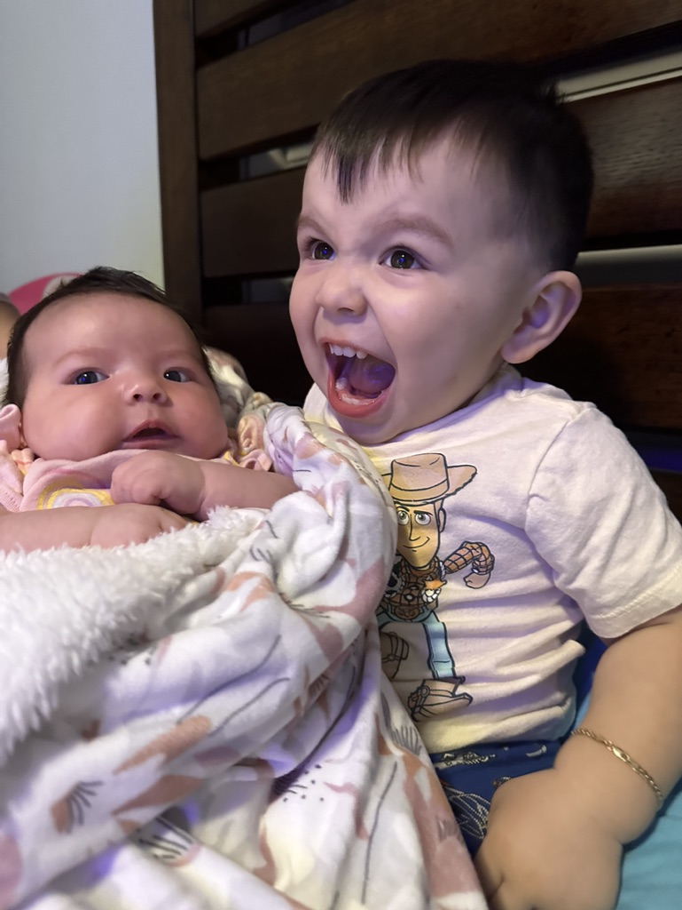

# My Code Fellow Reading Notes

>A failure is not always a mistake. It may simply be the best one can do under the circumstances. The real mistake is to stop trying.
>
*B.F. Skinner*

- [My Code Fellow Reading Notes](#my-code-fellow-reading-notes)
  - [Growth Mindset](#growth-mindset)
    - [About Me](#about-me)

## Growth Mindset

Growth mindset to me means to be presistent in obtaining an objective despite there being difficulty or uncertainty in the outcome.

- Remember that nothing is *Impossible* .

- Practice makes *Perfect*.

- *Dedication* and *Discipline* create a desired outcome.

### About Me

👋
Navy Veteran with a industry background in Construction jumping head first into the Tech World.
I am a proud father of a little boy and little girl, happily married, and owner of the cutest Shih-Tzu in the world.

[GitHub Profile](https://github.com/Diaz850)

- [My Code Fellow Reading Notes](#my-code-fellow-reading-notes)
  -[Code 102 Reading Notes](/Code-102/)
    [Class_01](/Code-102/Class-01.md)
